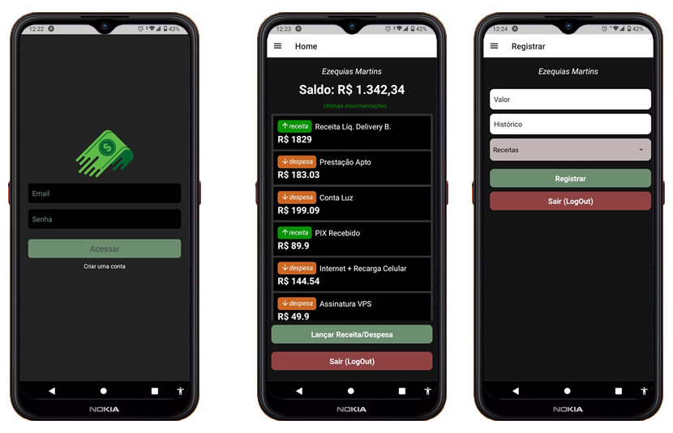

## psi-Financeiro (React Native)
App simples para Criar/Editar, Listar e Excluir suas Despesas e Receitas, baseado e adaptado do modelo "Finanças", apresentado no curso <a href="https://www.udemy.com/course/crusoreactnative">"React Native - Criando aplicativos do zero ao avançado" com Matheus Fraga (Udemy)</a>

## instalação
para instalar as dependências (node_modules) e executar o App, remova antes a pasta pasta "node_nodules" e o arquivo "yarn.lock" se existirem e execute o comando na pasta raiz:

<strong>yarn install</strong> 

e em seguida para executar digite:

<strong>expo start</strong>

## Contato

telefone: (31) 98410-7540 WhatsApp

email: ezequiasmartins@gmail.com

by <a href="https://ezequiasmartins.blogspot.com/" target="_blank">Ezequias Martins</a> ® 1999-2022 Direitos Reservados

